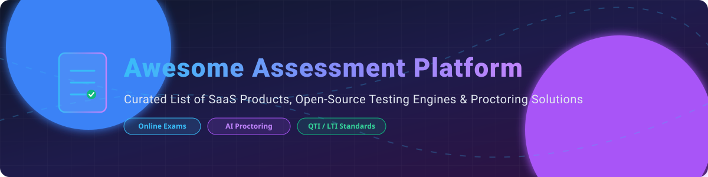

  

# 🎓 Awesome Assessment Platform

  
  
  
  

A curated, SEO-optimized list of top-tier **SaaS Assessment Platforms**, **Online Exam Software**, **Remote Proctoring Systems**, **Question Bank Management Tools**, and **Open-Source Testing Solutions** 🚀.

> 📊 **Market Overview & Sector Structure:**  
> The global digital assessment software market size was valued at **$5.8 Billion in 2025** and is projected to reach **$14.87 Billion by 2034** growing at a CAGR of **10.8%**. The market is **highly fragmented**, characterized by a diverse mix of large enterprise educational technology corporations, legacy testing centers, and agile specialized SaaS startups competing across academic, certification, and pre-employment talent assessment domains.

---

## 📑 Table of Contents
- [💼 SaaS & Commercial Assessment Platforms](#-saas--commercial-assessment-platforms)
- [🔓 Open-Source Assessment Platforms & Engines](#-open-source-assessment-platforms--engines)
- [🎯 Key Selection & Evaluation Criteria](#-key-selection--evaluation-criteria)
- [💖 Support & Sponsorship](#-support--sponsorship)
- [🤝 How to Contribute](#-how-to-contribute)
- [📈 Star History](#-star-history)
- [⚠️ Disclaimer](#%EF%B8%8F-disclaimer)

---

## 💼 SaaS & Commercial Assessment Platforms

Below is a breakdown of commercial assessment software, sorted by estimated company size/valuation (descending), complete with specific starting pricing tiers and free tier / trial limits 💳.

| Product / Company | Estimated Size (Revenue / Valuation) 💰 | Starting Paid Tier Price 🏷️ | Free Tier / Free Trial Limits 🎁 | Primary Use Case / Focus 🎯 |
| :--- | :--- | :--- | :--- | :--- |
| **[TestGorilla](https://www.testgorilla.com/)** | **$81.2M+ Valuation** ($36.2M ARR) | $142 / month (billed annually) | Free Forever Plan (10 free credits/mo, 5 core skills tests) | Pre-employment screening & technical talent assessment |
| **[ExamSoft](https://examsoft.com/)** *(Turnitin)* | **$50M+ ARR** (Acquired by Turnitin) | $35 / student / year (Institutional minimums apply) | 14-day institutional sandbox trial | High-stakes university, nursing & medical licensing exams |
| **[ProProfs Quiz Maker](https://www.proprofs.com/quiz-school/)** | **$38.9M ARR** | $20 / month (billed annually) | Free Plan (Up to 10 test takers / month, basic quizzes) | Corporate training quizzes & employee assessments |
| **[Inspera Assessment](https://www.inspera.com/)** | **$25M+ ARR** | $1,200 / year base license | 30-day institutional pilot trial (Up to 50 test candidates) | Digital university exams & secure online proctoring |
| **[Questionmark](https://www.questionmark.com/)** | **$20M+ ARR** | $1,000 / year starting package | 14-day enterprise trial (Max 25 candidate sessions) | Enterprise certification, regulatory compliance & government testing |
| **[TAO Testing (Commercial)](https://www.taotesting.com/)** | **$12M+ ARR** | €499 / month (Accelerate Plan) | 10-day commitment-free cloud trial | Enterprise QTI-compliant digital testing & cloud delivery |
| **[ClassMarker](https://www.classmarker.com/)** | **$8M+ ARR** | $39.95 / month (Professional 400 tests) | Free Plan (Up to 100 tests / month for non-commercial / educators) | Web-based online quizzes, exams, and business certification |
| **[Exam.net](https://exam.net/)** | **$5M+ ARR** | $180 / teacher / year | 75-day full-feature trial for schools & individual teachers | Secure digital school exams & lockdown browser testing |

---

## 🔓 Open-Source Assessment Platforms & Engines

A list of open-source e-testing systems, LMS quiz modules, and code execution backends, sorted by GitHub Star Count (descending) 🌟.

- **[Moodle Quiz Subsystem](https://github.com/moodle/moodle)** 🏫  
    
  Mature, enterprise-grade open-source LMS featuring a comprehensive quiz authoring engine, item banks, randomized question sets, automated grading, and extensive proctoring plugin ecosystem.

- **[Canvas LMS (Open Core)](https://github.com/instructure/canvas-lms)** 📚  
    
  Popular open-source learning management platform used by universities and schools worldwide with native assessment features, rubrics, and quiz delivery tools.

- **[SurveyJS Library](https://github.com/surveyjs/survey-library)** 📝  
    
  JavaScript form and survey library for building interactive quizzes, psychometric evaluations, and data-driven assessment forms in web applications.

- **[Judge0 Code Execution Engine](https://github.com/judge0/judge0)** ⚡  
    
  Robust open-source online code execution system and API for technical assessments, coding challenges, and programming exams supporting over 60 languages.

- **[LimeSurvey](https://github.com/LimeSurvey/LimeSurvey)** 📊  
    
  Leading open-source online survey tool adaptable for low-stakes online testing, evaluation forms, market research, and candidate questionnaires.

- **[Formio.js](https://github.com/Formio/formio.js)** 🛠️  
    
  Combined JSON schema form builder and rendering engine for building dynamic assessment interfaces and multi-page exam flows.

- **[ILIAS eLearning System](https://github.com/ILIAS-eLearning/ILIAS)** 🎓  
    
  Flexible open-source learning management platform equipped with specialized e-assessment components, question pools, and certification workflows.

- **[TAO Community Edition](https://github.com/oat-sa/package-tao)** 🌐  
    
  Leading open-source QTI-compliant (IMS Global standard) e-testing platform for open architecture authoring, test delivery, and interoperable item banks.

- **[Safe Exam Browser (SEB)](https://github.com/SafeExamBrowser/seb-mac)** 🔒  
    
  Custom web browser environment used to securely carry out e-assessments online by locking down unapproved software and web navigation.

- **[QST (Quiz/Survey/Test)](https://github.com/bobb34/QST)** 🧪  
    
  Multi-tenant, self-hosted open-source online assessment software designed for secure creation and delivery of exams, quizzes, and surveys.

---

## 🎯 Key Selection & Evaluation Criteria

When selecting an assessment software or platform for high-stakes testing, higher education, or talent acquisition, consider the following technical features 🔍:

1. **Standards Compliance:** QTI (Question and Test Interoperability) and LTI (Learning Tools Interoperability) support for seamless integration with existing LMS infrastructure.
2. **Proctoring & Integrity:** Integration with automated AI proctoring, lockdown browser solutions (e.g., Safe Exam Browser, Honorlock), and anti-cheat mechanisms.
3. **Item Bank & Authoring:** Support for diverse question formats (MCQ, essay, audio response, interactive coding), item response theory (IRT), and question randomization.
4. **Security & Accessibility:** WCAG 2.1 compliance, role-based access control (RBAC), and GDPR/FERPA compliance.

---

## 💖 Support & Sponsorship

Thank you so much for exploring this curated collection! If you find this list helpful for your project, institution, or organization, please consider giving it a ⭐ **Star**, **Forking** the repo, or sharing it with your peers 📢.

Your support helps maintain and grow this resource! If you'd like to buy me a coffee or support further open-source development, please visit the Sponsor Dashboard below ☕:

---

## 🤝 How to Contribute

1. Fork this repository.
2. Add your SaaS or open-source assessment tool entry to `README.md` following the exact table or list format.
3. Ensure all links are direct and factual pricing/star details are provided.
4. Open a Pull Request with a short summary of the addition.

---

## 📈 Star History

---

## ⚠️ Disclaimer

This repository is community-curated for informational and educational purposes. Financial estimates and star counts are regularly updated but subject to vendor changes. High-stakes testing deployment requires thorough security audit, accessibility validation, and compliance verification.

---

  <i>Made with ❤️ for assessment directors, software architects, educators, and enterprise recruiters.</i>

